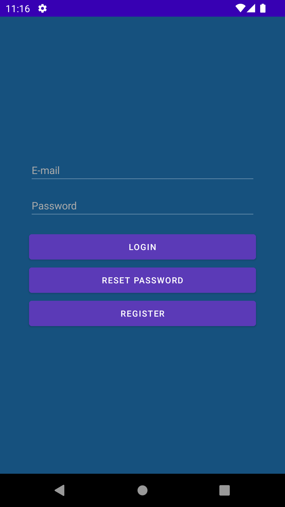
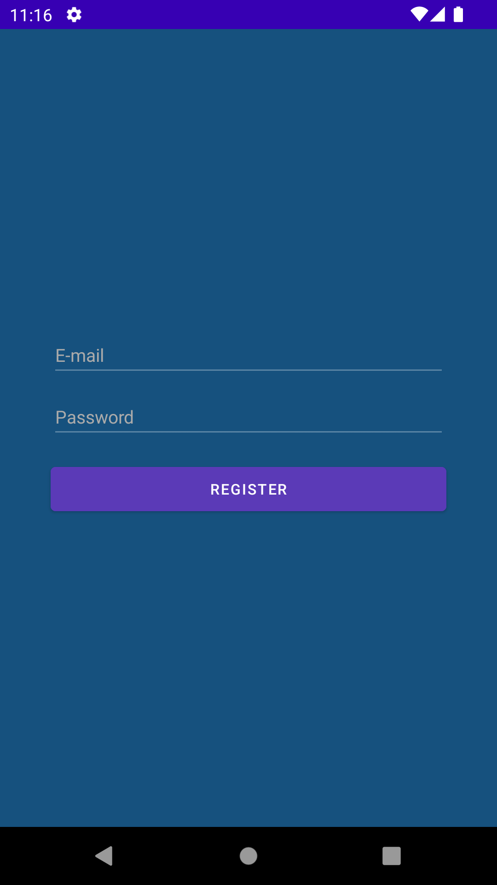
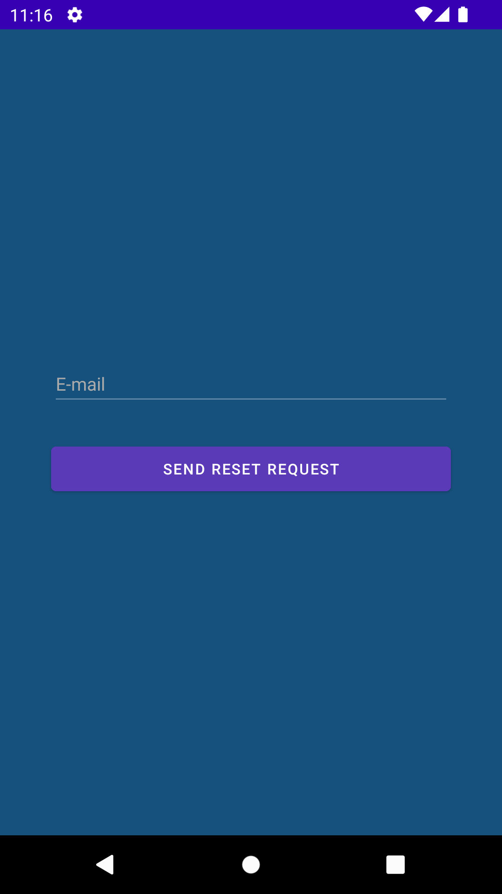
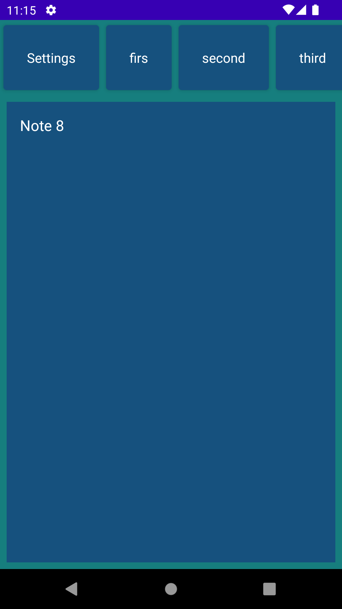
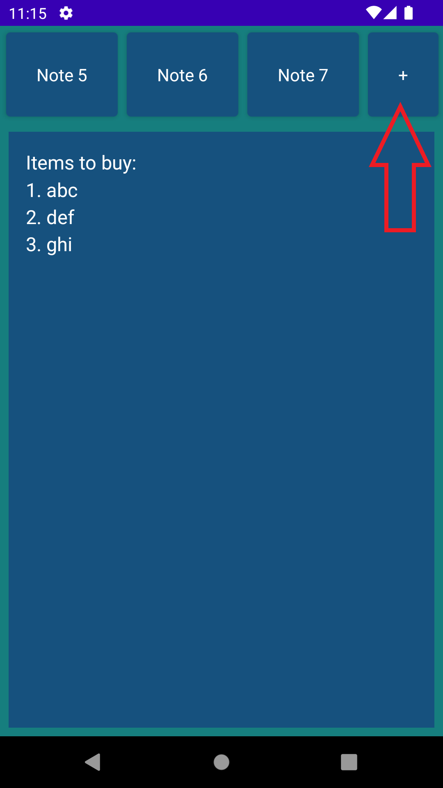
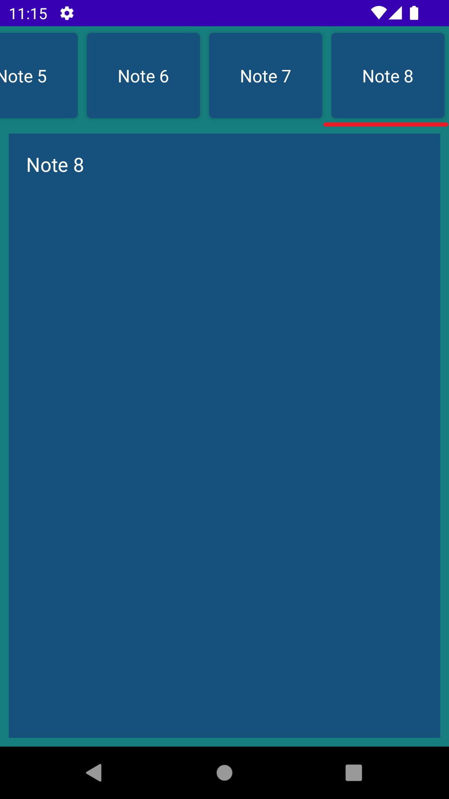
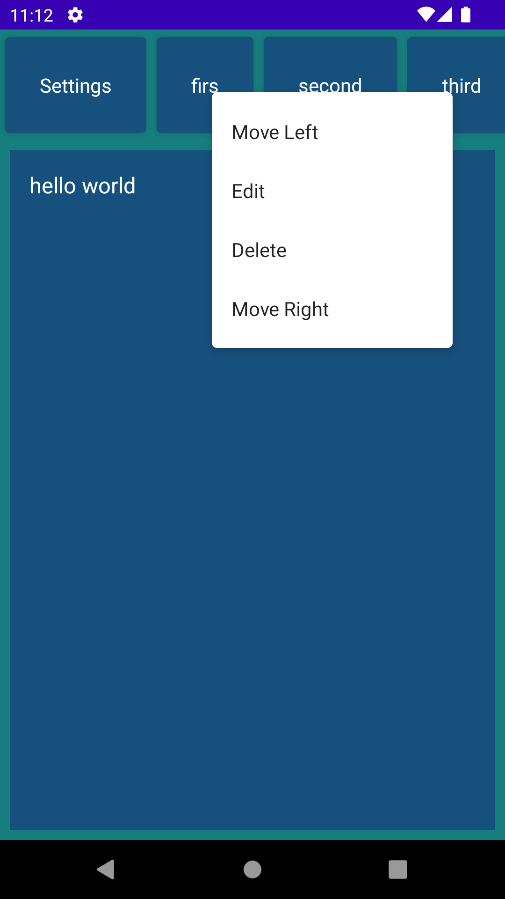
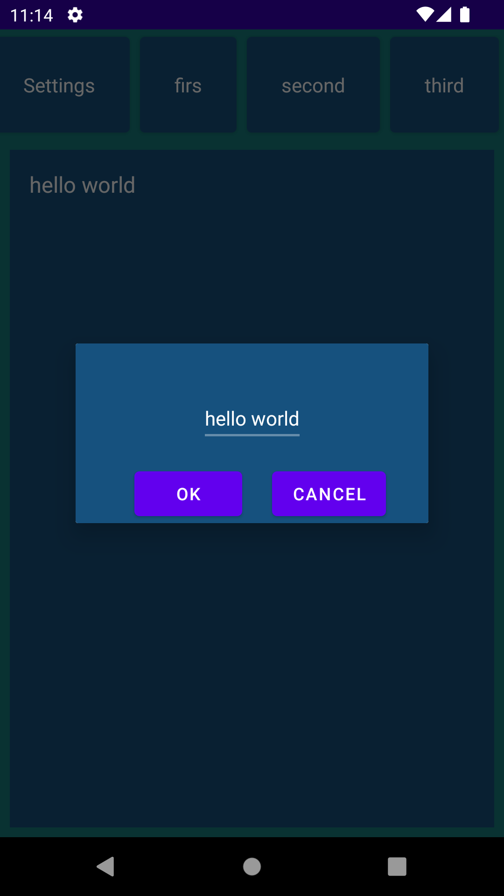
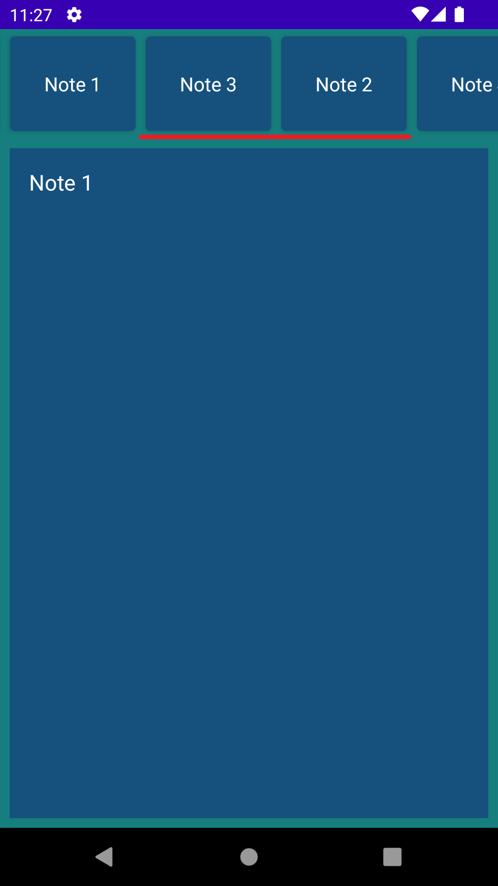
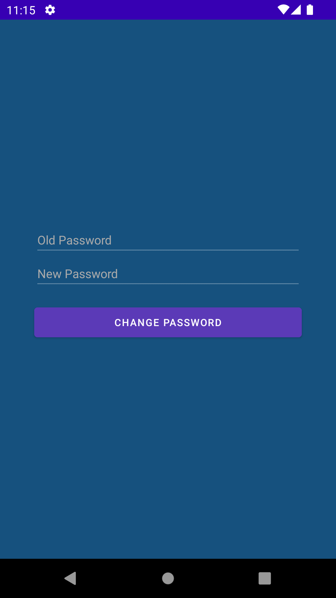

## აპლიკლაციის პირველი გვერდი

პირველ გვერდზე მომხმარებელს შეუძლია ანგარიშზე შესვლა. თუ კი მას არ გააჩნია ანგარიში, მას შეუძლია "**REGISTER**" ღილაკის მეშვეობით გადავიდეს [სარეგისტრაციო გვერდზე](##_რეგისტრაციის_გვერდი). ხოლო, თუ კი მას დაავიწყდა პაროლი, მას შეუძლია პაროლის აღდგენა "**RESET PASSWORD**" ღილაკის მეშვეობით, [პაროლის აღდგენის გვერდზე](##_პაროლის_აღდგენის_გვერდი) გადასვლით.

## რეგისტრაციის გვერდი

რეგისტრაციის გვერდზე იქმნება ახალი მომხმარებელი.

## პაროლის აღდგენის გვერდი

პაროლის აღდგენისთვის საჭიროა მომხმარებლის ელექტრონული e-mail ფოსტის მითითება, რომლიღას ის მანამდე დარეგისტრირდა. ამ ფოსტაზე გაიგზავნება წერილი ინსტრუქციებით პაროლის შესაცვლელად.

## ნიშნულების გვერდი

ეს არის მთავარი გვერდი ამ აპლიკაციაში. ამ გვერდზე მომხმარებელს შეუძლია ნახოს ყველა თავისი ღრუბელში ატვირთული ნიშნული, ახლების შექმნა და არსებულების წაშლა, მათი სათაურის და შემადგენლობის რედაქტირება და რიგის გადანაცვლება. ამასთან, აქედან მას შეუძლია [პარამეტრების გვერდზე](##_პარამეტრების_გვერდი) გადასვლა.

## პარამეტრების გვერდი

